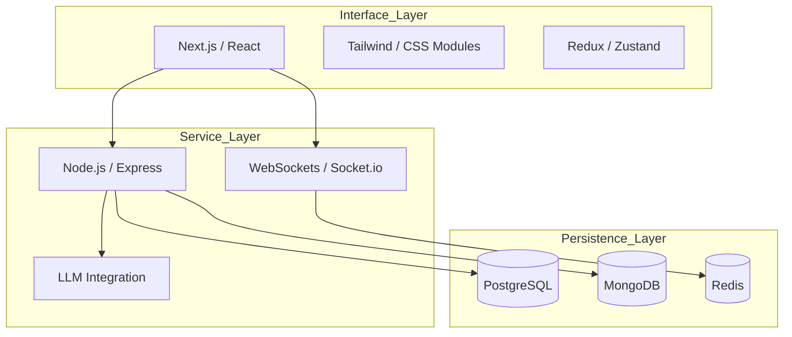
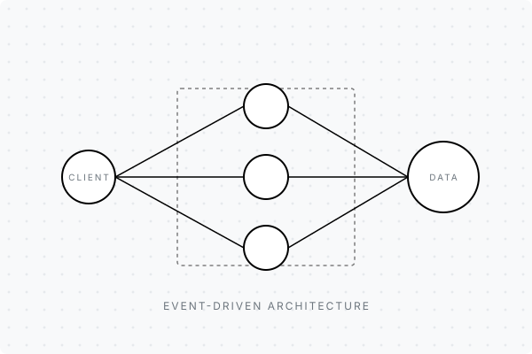
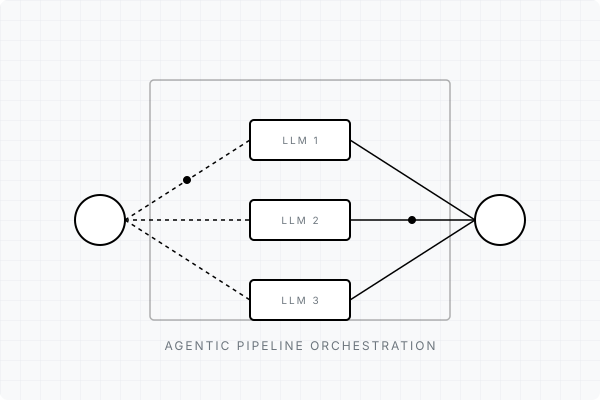

  

 

  <strong>SYS_SPEC_V1.0</strong> • ARCHITECTURE DOCUMENTATION • <strong>MAINTAINER:</strong> R. SAI DHEERAJ

  

## `1.0 ABSTRACT & OBJECTIVE`

  The engineering entity designated as <b>R. Sai Dheeraj</b> operates at the intersection of Artificial Intelligence, Full Stack Development, and Distributed Systems. The primary operational objective is to design and deploy software architectures that resolve complex real-world constraints with high availability, low latency, and uncompromising aesthetic precision.

 

## `2.0 DESIGN PRINCIPLES`

<table width="100%">
  <tr>
    <td width="50%">
      <strong>Craftsmanship</strong> 
      Every module, endpoint, and pixel is deployed with intentionality. Software is not merely functional; it is a meticulously constructed asset.
    </td>
    <td width="50%">
      <strong>Resilience</strong> 
      Architectures are designed anticipating failure. Graceful degradation, distributed state, and operational predictability are standard dependencies.
    </td>
  </tr>
  <tr>
    <td width="50%">
       
      <strong>Clarity</strong> 
      Complex systems require simple interfaces. Cognitive load is systematically minimized through rigorous product design and logical abstractions.
    </td>
    <td width="50%">
       
      <strong>Curiosity</strong> 
      Continuous recalibration of the knowledge base. Adapting to modern primitives while respecting foundational computing principles.
    </td>
  </tr>
</table>

 

## `3.0 RUNTIME METRICS`

<table width="100%">
  <tr>
    <td width="30%"><strong>Primary Process</strong></td>
    <td>Architecting AI-powered, real-time web systems.</td>
  </tr>
  <tr>
    <td width="30%"><strong>Background Threads</strong></td>
    <td>WebSockets, Agentic AI, Speech Pipelines, LLM Orchestration.</td>
  </tr>
  <tr>
    <td width="30%"><strong>Memory Allocation</strong></td>
    <td>Advanced component patterns, distributed database scaling, protocol optimization.</td>
  </tr>
</table>

 

## `4.0 SYSTEM DEPENDENCIES & ARCHITECTURE`

 

## `5.0 PRODUCTION DEPLOYMENTS`

<table width="100%">
  <tr>
    <td valign="top" width="50%">
      <h3>Deployment Alpha</h3>
      High-Availability Real-Time Application  
      <strong>Problem:</strong> Fragmented data streams causing high latency in client operations. 
      <strong>Solution:</strong> A unified event-driven architecture using WebSockets. 
      <strong>Decisions:</strong> Utilized Redis for pub/sub messaging to ensure state synchronization across node clusters. 
       
      <a href="#">Repository</a> • <a href="#">Live Endpoint</a> • <a href="#">Documentation</a>
    </td>
    <td valign="top" width="50%">
      
    </td>
  </tr>
</table>

 

<table width="100%">
  <tr>
    <td valign="top" width="50%">
      
    </td>
    <td valign="top" width="50%">
      <h3>Deployment Beta</h3>
      AI-Integrated Product Platform  
      <strong>Problem:</strong> Inefficient manual data processing pipelines scaling poorly. 
      <strong>Solution:</strong> Agentic AI pipeline with sub-second inference caching. 
      <strong>Decisions:</strong> Orchestrating multiple LLM calls through a custom priority queue to manage rate limits. 
       
      <a href="#">Repository</a> • <a href="#">Live Endpoint</a> • <a href="#">Documentation</a>
    </td>
  </tr>
</table>

 

## `6.0 OPERATIONAL HISTORY`

<table width="100%">
  <tr>
    <td width="20%"><strong>Current</strong></td>
    <td><strong>Independent Engineer & Architect</strong> Designing robust enterprise solutions and agentic AI integrations.</td>
  </tr>
  <tr>
    <td width="20%"><strong>2024</strong></td>
    <td><strong>Product Developer</strong> Shipped high-performance, real-time web platforms from zero to one.</td>
  </tr>
  <tr>
    <td width="20%"><strong>2023</strong></td>
    <td><strong>CS Undergraduate</strong> Establishing foundational expertise in distributed computing and systemic frameworks.</td>
  </tr>
</table>

 

## `7.0 KNOWLEDGE BASE & OPEN SOURCE`

The open-source ecosystem provides the primitives for modern infrastructure. Development cycles are consistently directed towards improving developer tooling, enhancing system observability, and refining runtime performance metrics.

 

## `8.0 TELEMETRY`

  

 

  <strong>ACTIVITY GRAPH // CONTRIBUTION PIPELINE</strong>  
  <picture>
    <source media="(prefers-color-scheme: dark)" srcset="https://raw.githubusercontent.com/SaiDheeraj-19/SaiDheeraj-19/output/github-contribution-grid-snake-dark.svg">
    <source media="(prefers-color-scheme: light)" srcset="https://raw.githubusercontent.com/SaiDheeraj-19/SaiDheeraj-19/output/github-contribution-grid-snake.svg">
    
  </picture>

 

## `9.0 PROTOCOL TERMINATION // HANDSHAKE`

  For architectural discussions, engineering collaborations, or operational deployment inquiries, initialize contact via the following protocols:

<table width="100%">
  <tr>
    <td align="center" width="33%"><a href="mailto:16saidheeraj@gmail.com"><strong>SMTP</strong> // Email</a></td>
    <td align="center" width="33%"><a href="https://linkedin.com/in/sai-dheeraj-a1145830b"><strong>TCP</strong> // LinkedIn</a></td>
    <td align="center" width="33%"><a href="https://saidheeraj.co.in"><strong>HTTP</strong> // Portfolio</a></td>
  </tr>
</table>

  

  <svg width="24" height="24" viewBox="0 0 24 24" fill="none" stroke="currentColor" stroke-width="2" stroke-linecap="round" stroke-linejoin="round">
    <circle cx="12" cy="12" r="10"></circle>
    <polyline points="12 6 12 12 16 14"></polyline>
  </svg>
   
  END OF SPECIFICATION

