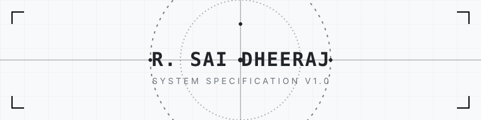
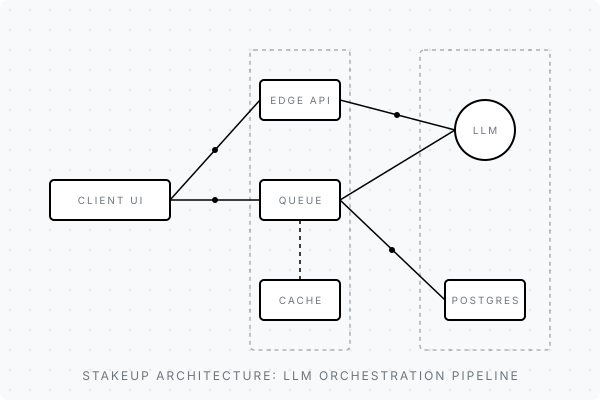
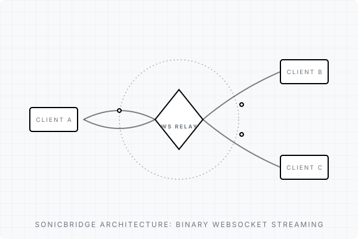

  <picture>
    <source media="(prefers-color-scheme: dark)" srcset="./assets/svg/hero-banner.svg">
    <source media="(prefers-color-scheme: light)" srcset="./assets/svg/hero-banner.svg">
    
  </picture>

 

  <strong>ENGINEERING SPECIFICATION</strong> • REVISION 2026.07 
  <strong>MAINTAINER:</strong> R. SAI DHEERAJ 
  B.Tech Computer Science & Engineering • G.P.C.E.T 
  AI • Full Stack • System Design

  

## `1.0 ABSTRACT & OBJECTIVE`

  <strong>I am a Full-Stack Developer and AI Engineer</strong> focused on building intelligent, scalable, and production-ready software products that solve real-world problems.

  I enjoy transforming ideas into practical digital products by combining software engineering, artificial intelligence, system design, and product thinking. My work spans full-stack web development, mobile applications, AI-powered systems, real-time platforms, automation solutions, and end-to-end product engineering.

  As an AI Engineer, my work and interests span Generative AI, Large Language Models, Computer Vision, Deep Learning, Natural Language Processing, AI Agents, intelligent automation, multimodal AI, and AI model integration. I am particularly interested in taking AI beyond experimentation and integrating intelligent capabilities into reliable software products that users can actually interact with and benefit from.

 

## `2.0 ENGINEERING DOMAINS`

  I work across the complete software development lifecycle — from understanding a problem and defining the product requirements to designing system architecture, developing applications, integrating AI capabilities, building APIs and databases, testing, deploying, and continuously improving the product.

<table width="100%">
  <tr>
    <td width="50%" valign="top">
      <strong>Core Competencies</strong> 
      • Full-Stack Web Development 
      • Artificial Intelligence and Machine Learning 
      • Generative AI and Large Language Models 
      • Computer Vision and Deep Learning 
      • Natural Language Processing 
      • AI Agents and Intelligent Automation
    </td>
    <td width="50%" valign="top">
      <strong>Systems & Architecture</strong> 
      • Multimodal AI Applications 
      • Real-Time and WebSocket-Based Systems 
      • System Design and Scalable Architecture 
      • Backend and API Engineering 
      • Mobile Application Development 
      • Cloud and Product Engineering
    </td>
  </tr>
</table>

 

## `3.0 BUILDING REAL-WORLD PRODUCTS`

  I have built and worked on multiple full-stack and AI-powered applications across different problem domains. My projects include <strong>StakeUp</strong> (AI-powered accountability platform), <strong>HomeProof</strong> (AI-powered property inspection), <strong>SonicBridge</strong> (low-latency audio streaming), <strong>Aura</strong> (speech-to-text platform), <strong>ClassSync</strong> (academic management), <strong>Wave</strong> (social music platform), and <strong>Fix It</strong> (POS system).

  These projects have given me experience working with AI pipelines, computer vision, speech processing, real-time communication, authentication, databases, APIs, cloud services, and scalable application architecture.

 

## `4.0 SYSTEM DEPENDENCIES & PROJECTS`

<table width="100%">
  <tr>
    <td valign="top" width="50%">
      <h3>StakeUp</h3>
      AI-Powered Accountability Platform  
      <strong>Problem:</strong> Lack of automated, scalable systems for maintaining accountability and tracking goals. 
      <strong>Solution:</strong> A full-stack Next.js application leveraging AI for dynamic goal tracking and accountability. 
      <strong>Impact:</strong> Secured 1st place in the Syntax2Code Hackathon. 
       
      

        
<strong>View Architectural Breakdown</strong>

         
        <strong>Architecture:</strong> Client-side rendering integrated with a serverless backend processing heavy LLM inference queues. 
        <strong>Engineering Decisions:</strong> Offloaded heavy state computations to serverless functions to maintain 60FPS UI rendering. 
        <strong>Challenges:</strong> Managing LLM rate limits and inference latency. Solved by implementing a custom priority queue and caching layer. 
        <strong>Technologies:</strong> Next.js, Node.js, OpenAI API, PostgreSQL. 
      

       
      <a href="#">Repository</a> • <a href="#">Live Demo</a>
    </td>
    <td valign="top" width="50%">
      
    </td>
  </tr>
</table>

 

<table width="100%">
  <tr>
    <td valign="top" width="50%">
      
    </td>
    <td valign="top" width="50%">
      <h3>SonicBridge</h3>
      Low-Latency Audio Streaming Protocol  
      <strong>Problem:</strong> High latency and jitter in standard web-based audio transmission protocols. 
      <strong>Solution:</strong> Custom implementation using raw WebSockets to stream binary audio buffers. 
      <strong>Impact:</strong> Designed for low-latency communication across distributed clients, suitable for real-time collaboration. 
       
      

        
<strong>View Architectural Breakdown</strong>

         
        <strong>Architecture:</strong> Event-driven WebSocket server orchestrating peer connections and buffer synchronization. 
        <strong>Engineering Decisions:</strong> Bypassed standard HTTP overhead by establishing persistent TCP connections and sending compressed binary packets. 
        <strong>Challenges:</strong> Handling packet loss and buffer underruns in the browser's AudioContext. 
        <strong>Technologies:</strong> Node.js, WebSockets, Web Audio API, ArrayBuffers. 
      

       
      <a href="#">Repository</a> • <a href="#">Live Demo</a>
    </td>
  </tr>
</table>

 

<table width="100%">
  <tr>
    <td width="30%"><strong>HomeProof</strong></td>
    <td>
      AI-powered property inspection platform. Built with FastAPI, YOLOv8, and Google Gemini for automated property validation and AI-assisted inspection. 
      <a href="#">Repository</a> • <a href="#">Live Demo</a>
    </td>
  </tr>
  <tr>
    <td width="30%"><strong>ClassSync</strong></td>
    <td>
      Secure authentication and scheduling system. Deployed JWT-based stateless auth and role-based access control (RBAC) to handle concurrent university schedules. 
      <a href="#">Repository</a> • <a href="#">Live Demo</a>
    </td>
  </tr>
  <tr>
    <td width="30%"><strong>Solvra</strong></td>
    <td>
      Agentic AI problem solver. Utilized prompt chaining and multi-agent coordination to resolve complex logic constraints autonomously. 
      <a href="#">Repository</a> • <a href="#">Live Demo</a>
    </td>
  </tr>
</table>

 

## `5.0 PROFESSIONAL EXPERIENCE`

<table width="100%">
  <tr>
    <td width="25%" valign="top"><strong>Current</strong></td>
    <td>
      <strong>Artificial Intelligence Engineer</strong> — Sync AI Technologies Pvt Ltd 
      Focusing on AI-driven software and engineering solutions.
    </td>
  </tr>
  <tr>
    <td width="25%" valign="top">
      <strong>May 2026 - Aug 2026</strong> 
      Remote, India
    </td>
    <td>
      <strong>Developer Intern</strong> — RootedLabs 
      Joined RootedLabs as a Developer Intern and successfully developed the company's official website from concept to deployment. This role has provided hands-on experience in full-stack development, product engineering, system design, and working in a fast-paced startup environment.
    </td>
  </tr>
  <tr>
    <td width="25%" valign="top"><strong>Current</strong></td>
    <td>
      <strong>Full Stack Architect & Technical Team Lead</strong> — RMJ IT Solutions 
      Contributed to the architecture and development of MicroIntern, an AI-powered skill assessment and recruitment platform. Worked on system architecture, backend development, database design, AI pipelines, API integrations, security, and DevOps workflows.
    </td>
  </tr>
</table>

 

## `6.0 LEADERSHIP & ACHIEVEMENTS`

  I enjoy taking technical ownership of projects and working with teams to turn ideas into functioning products.

<table width="100%">
  <tr>
    <td width="15%" align="center"><h1>🥇</h1></td>
    <td width="85%">
      <strong>Syntax2Code Industry Simulation Hackathon 2026</strong> — 1st Place 
      <strong>Role:</strong> Team Leader & Full-Stack Architect (Team of 5) 
      Designed the end-to-end architecture and oversaw frontend, backend, and AI development for StakeUp within a 24-hour sprint. Received a 6-month internship opportunity for technical execution and innovation.
    </td>
  </tr>
  <tr>
    <td width="15%" align="center"><h1>🥈</h1></td>
    <td width="85%">
      <strong>TechXplore 2026</strong> — 2nd Place 
      Independently developed and presented a working software solution.
    </td>
  </tr>
  <tr>
    <td width="15%" align="center"><h1>🥉</h1></td>
    <td width="85%">
      <strong>NEXORA Hackathon 2026</strong> — 3rd Place 
      Independently developed and presented an end-to-end working prototype.
    </td>
  </tr>
</table>

 

## `7.0 ENGINEERING PRINCIPLES & VISION`

<table width="100%">
  <tr>
    <td width="50%" valign="top">
      <strong>Approach to Engineering</strong> 
      I believe great software is not simply about writing code. It starts with understanding the problem. The best solutions come from combining strong engineering fundamentals with thoughtful product design, reliable architecture, and technology that genuinely serves the user's needs. My workflow: <strong>Understand → Design → Build → Integrate → Test → Deploy → Improve</strong>.
    </td>
    <td width="50%" valign="top">
      <strong>What Drives Me</strong> 
      I am particularly interested in the intersection of software engineering and artificial intelligence. The rapid evolution of AI is creating new possibilities for how software can be designed, built, and experienced. My long-term goal is to continue developing as an engineer, work on increasingly challenging technical problems, contribute to ambitious products, and eventually build technology that can create meaningful impact at scale. I am continuously learning, experimenting with emerging technologies, and turning ideas into working products.
    </td>
  </tr>
</table>

 

## `8.0 SYSTEM OBSERVABILITY`

### `[A] REPOSITORY HEALTH`
<table width="100%">
  <tr>
    <td valign="top" width="50%" align="center">
      <picture>
        <source media="(prefers-color-scheme: dark)" srcset="https://github-stats-extended.vercel.app/api?username=SaiDheeraj-19&show_icons=true&hide_border=true&hide_rank=true&hide_title=true&theme=transparent&bg_color=00000000&title_color=8b949e&text_color=8b949e&icon_color=8b949e">
        <source media="(prefers-color-scheme: light)" srcset="https://github-stats-extended.vercel.app/api?username=SaiDheeraj-19&show_icons=true&hide_border=true&hide_rank=true&hide_title=true&theme=transparent&bg_color=00000000&title_color=24292f&text_color=24292f&icon_color=24292f">
        
      </picture>
    </td>
    <td valign="top" width="50%" align="center">
      <picture>
        <source media="(prefers-color-scheme: dark)" srcset="https://github-stats-extended.vercel.app/api/top-langs/?username=SaiDheeraj-19&layout=compact&hide_border=true&theme=transparent&bg_color=00000000&title_color=8b949e&text_color=8b949e">
        <source media="(prefers-color-scheme: light)" srcset="https://github-stats-extended.vercel.app/api/top-langs/?username=SaiDheeraj-19&layout=compact&hide_border=true&theme=transparent&bg_color=00000000&title_color=24292f&text_color=24292f">
        
      </picture>
    </td>
  </tr>
</table>

### `[B] AUTOMATION & TRAFFIC`
<table width="100%">
  <tr>
    <td align="center" width="80%">
      <picture>
        <source media="(prefers-color-scheme: dark)" srcset="https://raw.githubusercontent.com/SaiDheeraj-19/SaiDheeraj-19/output/github-contribution-grid-snake-dark.svg">
        <source media="(prefers-color-scheme: light)" srcset="https://raw.githubusercontent.com/SaiDheeraj-19/SaiDheeraj-19/output/github-contribution-grid-snake.svg">
        
      </picture>
    </td>
    <td align="center" width="20%">
      <strong>VISITOR TELEMETRY</strong>  
      
    </td>
  </tr>
</table>

 

## `9.0 CERTIFICATIONS`

  <strong>Oracle • Google • NVIDIA • Coursera • Microsoft • TATA Forage • Deloitte</strong>

 

## `10.0 PROTOCOL TERMINATION // HANDSHAKE`

  <strong>Let's Build:</strong> I am open to collaborating with ambitious teams, developers, founders, and organizations working on meaningful technical problems. If you are interested in AI engineering, full-stack development, product engineering, intelligent automation, or building something from the ground up, feel free to connect.

  <strong>R. Sai Dheeraj</strong> 
  Full-Stack Developer | AI Engineer 
  Building intelligent software. Turning ideas into products.

   
  <a href="mailto:16saidheeraj@gmail.com"><strong>SMTP</strong> // Email</a>
  &nbsp;&nbsp;&nbsp;|&nbsp;&nbsp;&nbsp;
  <a href="https://linkedin.com/in/sai-dheeraj-a1145830b"><strong>TCP</strong> // LinkedIn</a>
  &nbsp;&nbsp;&nbsp;|&nbsp;&nbsp;&nbsp;
  <a href="https://saidheeraj.co.in"><strong>HTTP</strong> // Portfolio</a>
    

  

  <svg width="24" height="24" viewBox="0 0 24 24" fill="none" stroke="currentColor" stroke-width="2" stroke-linecap="round" stroke-linejoin="round">
    <circle cx="12" cy="12" r="10"></circle>
    <polyline points="12 6 12 12 16 14"></polyline>
  </svg>
   
  END OF SPECIFICATION

