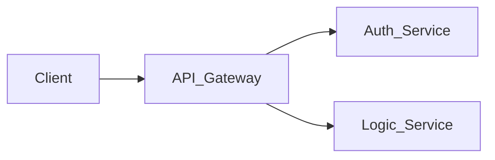

# SYSTEM SPECIFICATION: SVG & Diagram Specifications

## 1. SVG Banner Specifications

To maintain the Apple/Linear aesthetic, any graphical assets (like the hero banner or project placeholders) must adhere to these SVG constraints:

- **Dimensions (Hero)**: `800px x 200px` (or aspect ratio `4:1`)
- **Dimensions (Project)**: `600px x 400px` (or aspect ratio `3:2`)
- **Styling**: 
  - Do not use raster images (PNG/JPG).
  - Use vector graphics exclusively.
  - Employ a monochromatic or dual-tone palette (e.g., `#ECECEC` lines on a `#FFFFFF` background, or `#333333` lines on a `#0D0D0D` background, utilizing CSS `prefers-color-scheme`).
  - Lines should be thin (`stroke-width="1"` or `"1.5"`).
  - Use geometric shapes, grid lines, and technical crosshairs to reinforce the "System Spec" theme.

## 2. Mermaid Diagram Specifications

Mermaid diagrams are used to represent architecture natively within Markdown. 

- **Layout**: Always use `graph TD` (Top-Down) or `graph LR` (Left-Right) to keep diagrams organized.
- **Node Styling**: Rely on Mermaid's default GitHub styling. Do not override colors inline, as this breaks accessibility in dark/light mode toggles.
- **Grouping**: Use `subgraph` extensively to denote boundaries (e.g., `Interface_Layer`, `Persistence_Layer`).

Example base standard for any new microservice diagram:

